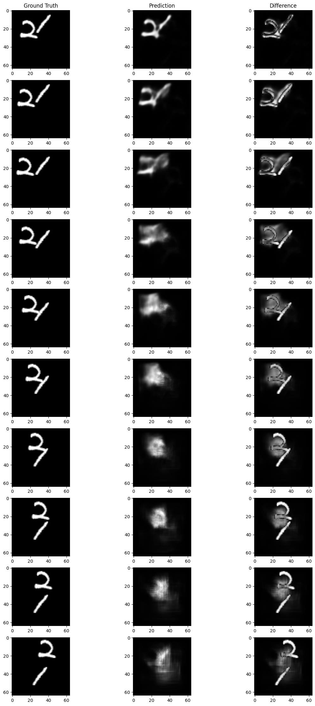
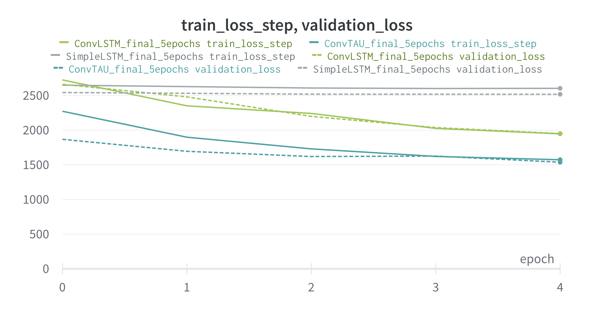

# VideoPrediction_MovingMNIST

Prediction of future frames given past video frames.

 

## Dataset 
[Moving MNIST](https://paperswithcode.com/dataset/moving-mnist). Introduced by Srivastava et al. in Unsupervised Learning of Video Representations using LSTMs. The Moving MNIST dataset contains 10,000 video sequences, each consisting of 20 frames. In each video sequence, two digits move independently around the frame, which has a spatial resolution of 64×64 pixels. The digits frequently intersect with each other and bounce off the edges of the frame. 

## ConvTAU
[Temporal Attention Unit: Towards Efficient Spatiotemporal Predictive Learning](https://paperswithcode.com/paper/temporal-attention-unit-towards-efficient)

  

We extended the original architecture to include the use of **Optical Flow** as an additional encoding of video frames. The following image shows the predictions after a training of only 5 epochs:

  

## Baseline Models

### Conv+LSTM

  

### SimpleLSTM

  

## Metrics 
Mean Squared Error.
Training sessions data available [here](https://wandb.ai/worst_dream_team/DeepLearning).

The following charts refer to the three models trained for 5 epochs:

  

  
